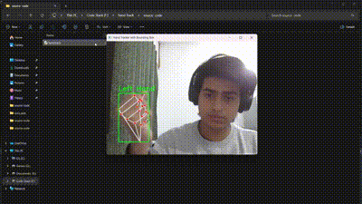

                                             -->Hand Tracking<--

<!DOCTYPE html>
<html lang="en">
<body>
    
</body>
</html>


This project demonstrates a hand tracking system developed using Python and OpenCV. The application captures real-time video input from a webcam and detects hand landmarks, making it suitable for applications such as gesture recognition and human-computer interaction.

---> Key Features :)

- **Real-Time Detection**: Tracks hand movements and landmarks in real-time using webcam input.
- **Visualization**: Displays detected hand landmarks on the video feed for easy visualization.
- **Extensibility**: Provides a solid base for further development and enhancements, such as gesture recognition.

--> Prerequisites  :)

- Python 3.x
- OpenCV
- Other dependencies as listed in `requirements.txt`

-> Installation

Clone the repository and install the required dependencies:

```bash

--> pip install -r requirements.txt
-> cv2
-> mediapipe

